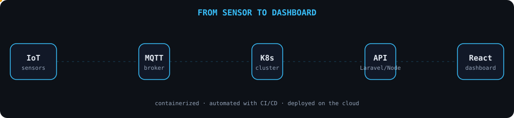

<div align="center">


<br>

<a href="https://bd.linkedin.com/in/iamtanoy">
  
</a>
<a href="mailto:tanoymd586@gmail.com">
  
</a>
<a href="https://github.com/khaliduzzamantanoy">
  
</a>

<br><br>


</div>


## 👨‍💻 About Me


```typescript
const tanoy = {
  name: "MD. Khaliduzzaman Tanoy",
  location: "Dhaka, Bangladesh",

  roles: [
    "Full Stack Developer",
    "Cloud & DevOps",
    "IoT Developer"
  ],

  stack: {
    backend: ["Laravel", "Flask", "Node.js", "Express"],
    frontend: ["React", "JavaScript", "Tailwind"],
    devops: [
      "Kubernetes",
      "Docker",
      "CI/CD",
      "Terraform",
      "Linux"
    ],
    iot: [
      "MQTT",
      "ESP32",
      "Raspberry Pi",
      "Arduino"
    ],
    data: [
      "MongoDB",
      "MySQL",
      "PostgreSQL",
      "Redis"
    ]
  },

  learning: [
    "Kubernetes scaling & ingress",
    "Infrastructure as Code",
    "Advanced React"
  ],

  openTo: "Freelance projects & collaborations"
};
```

<br clear="right" />


## 🛠️ Tech Stack

<div align="center">

### Backend


### Frontend


### Cloud & DevOps


### IoT & Embedded


<br>


### Databases


### Tools


</div>


## ⚙️ How I Build

<div align="center">



</div>


## 🚀 Featured Projects

<table>
<tr>

<td width="50%" align="center">

<a href="https://github.com/khaliduzzamantanoy/bulkmail">
  
</a>

<br>

<sub>
<b>Python · Flask · SMTP · MongoDB</b>
<br>
Email automation with templates and scheduling.
</sub>

</td>

<td width="50%" align="center">

<a href="https://github.com/khaliduzzamantanoy/wellness-tracker">
  
</a>

<br>

<sub>
<b>JavaScript · Node.js · MongoDB · REST API</b>
<br>
Fitness and nutrition tracking with data visualization.
</sub>

</td>

</tr>

<tr>

<td width="50%" align="center">

<a href="https://github.com/khaliduzzamantanoy/doingflowcall">
  
</a>

<br>

<sub>
<b>Python · Flask · WebRTC</b>
<br>
Automated calling with workflows and real-time communication.
</sub>

</td>

<td width="50%" align="center">

<a href="https://github.com/khaliduzzamantanoy/Pyredirect">
  
</a>

<br>

<sub>
<b>Python · Flask · SQLite</b>
<br>
URL shortener with click analytics and custom domains.
</sub>

</td>

</tr>
</table>


## 📊 GitHub Analytics

<div align="center">


<br><br>


<br><br>


<br><br>


</div>


## 🏆 GitHub Trophies

<div align="center">


</div>


## 🐍 Contribution Snake

<div align="center">

<picture>

<source
 media="(prefers-color-scheme: dark)"
 srcset="https://raw.githubusercontent.com/khaliduzzamantanoy/khaliduzzamantanoy/output/github-contribution-grid-snake-dark.svg"
/>

<source
 media="(prefers-color-scheme: light)"
 srcset="https://raw.githubusercontent.com/khaliduzzamantanoy/khaliduzzamantanoy/output/github-contribution-grid-snake.svg"
/>


</picture>

</div>


## 📌 Latest Activity

<!-- RECENT-ACTIVITY:START -->

<!-- RECENT-ACTIVITY:END -->


<div align="center">

## 🤝 Let's Build Something Together

<a href="mailto:tanoymd586@gmail.com">
  
</a>

<br><br>


<br><br>


<br><br>


</div>
